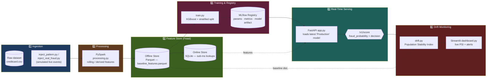
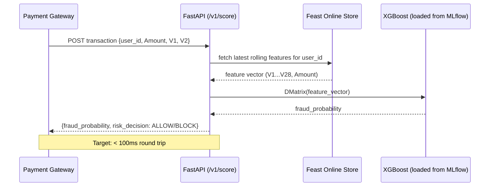
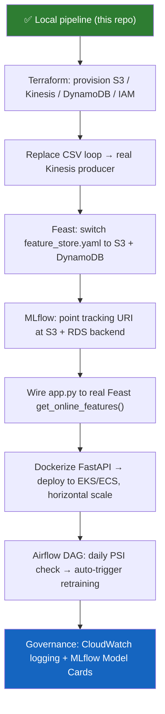

<div align="center">

# 🏦 Real-Time Fraud Detection — MLOps Pipeline

### An end-to-end, production-styled MLOps system for real-time credit card fraud scoring — built serial-and-local, designed for cloud-scale.

[](https://www.python.org/)
[](https://mlflow.org/)
[](https://feast.dev/)
[](https://spark.apache.org/)
[](https://xgboost.ai/)
[](https://fastapi.tiangolo.com/)
[](https://streamlit.io/)


</div>

---

## 🎯 The Motive

Fraud detection is one of the few ML problems where **latency is a feature, not a nice-to-have**. A model that correctly flags a stolen card *after* the money has already left the account is worthless. This project exists to prove — end‑to‑end, not just on a slide — that a fraud pipeline can move from **raw event → engineered features → model score → business decision** inside the latency budget a real payment gateway would demand, while still satisfying the boring-but-critical requirements banks actually care about: **reproducibility, lineage, and auditability.**

Concretely, this repo answers one question: *"If I had to design the fraud-detection stack for a bank, what would every layer look like, and why would I choose that tool over the traditional alternative?"*

| Layer | What it proves |
|---|---|
| Streaming ingestion | The system reacts to *events*, not nightly batches |
| Feature Store (Feast) | Training and serving use the **exact same feature logic** (no train/serve skew) |
| MLflow Registry | Every model in production is traceable back to its data, params, and code |
| FastAPI serving | Inference happens inside a payment-gateway-realistic SLA |
| Drift + PSI + Airflow (design) | Model decay is detected automatically, not discovered via a customer complaint |
| Governance layer | Every decision is explainable after the fact — a regulatory requirement, not an afterthought |

---

## 🗺️ Original Design vs. What Was Actually Shippable

The pipeline was **first designed for full AWS-scale deployment**: Terraform-provisioned infrastructure, Kinesis streams, EMR/Databricks Spark clusters, a DynamoDB-backed Feast online store, and Airflow-orchestrated retraining — the kind of stack a bank like Barclays would actually run.

That version costs real money to keep alive (Kinesis shards, EMR clusters, RDS, NAT gateways don't have a meaningful free tier), so this repository ships a **locally-runnable, serial equivalent** of the same architecture. The key design decision was making sure **the substitution never touches the *logic*, only the *infrastructure* underneath it** — so the migration path back to AWS is a config change, not a rewrite.

<table>
<tr>
<th>Pipeline Stage</th>
<th>🖥️ Local Implementation (this repo)</th>
<th>☁️ Production Target (Barclays-scale)</th>
<th>Why the swap is safe</th>
</tr>
<tr>
<td><b>Ingestion</b></td>
<td>Python generator / loop (<code>inject_pattern.py</code>, <code>inject_real_fraud.py</code>)</td>
<td>AWS Kinesis Data Streams / Apache Kafka</td>
<td>Logic already treats every record as an independent async event — no batch assumptions baked in</td>
</tr>
<tr>
<td><b>Processing</b></td>
<td><code>pyspark</code> in <code>local[*]</code> mode on CPU cores</td>
<td>AWS EMR / Databricks cluster</td>
<td>PySpark code is identical whether it runs on 1 core or 1,000 — only <code>.master()</code> changes</td>
</tr>
<tr>
<td><b>Feature Store</b></td>
<td>Feast — file-based offline store (Parquet) + SQLite online store</td>
<td>Feast — S3 offline store + DynamoDB/Redis online store</td>
<td>Only <code>feature_store.yaml</code> changes — feature <i>definitions</i> and retrieval API stay identical</td>
</tr>
<tr>
<td><b>Model Registry</b></td>
<td>MLflow, local file backend (<code>mlruns/</code>)</td>
<td>MLflow, S3 artifact store + AWS RDS backend</td>
<td><code>mlflow.log_metric(...)</code>, <code>mlflow.xgboost.log_model(...)</code> calls don't change at all</td>
</tr>
<tr>
<td><b>Serving</b></td>
<td>FastAPI on <code>localhost:8000</code></td>
<td>FastAPI in Docker on AWS EKS / ECS</td>
<td>The service is stateless — it loads the model on boot and holds no session state, so it scales horizontally by just adding replicas</td>
</tr>
</table>

---

## 🏗️ Architecture



### Request lifecycle for a single transaction



---

## 📂 Repository Structure

```
Real-Time-Fraud-MLOps/
├── feature_repository/
│   ├── definitions.py         # Feast Entity + FeatureView (user_id → V1...V28, Amount, Class)
│   └── feature_store.yaml     # Local provider config: SQLite online, file-based offline
├── src/
│   ├── processing.py          # PySpark feature computation (local[*] Spark session)
│   ├── train.py                # Prepares Feast-compliant Parquet + trains/registers XGBoost via MLflow
│   ├── app.py                   # FastAPI inference microservice — /v1/score endpoint
│   ├── drift.py                 # Population Stability Index (PSI) implementation
│   └── dashboard.py            # Streamlit governance dashboard (PSI, KPIs, alerts)
├── inject_pattern.py           # Injects a learnable fraud rule into the raw dataset
├── inject_real_fraud.py        # Appends synthetic extreme-value fraud rows
└── requirements.txt
```

---

## ▶️ Running It Locally

```bash
# 1. Install dependencies
pip install -r requirements.txt

# 2. Prepare the dataset (place creditcard.csv under data/raw/, then inject signal)
python inject_pattern.py
python inject_real_fraud.py

# 3. Apply the Feast feature definitions
cd feature_repository && feast apply && cd ..

# 4. Sanity-check the PySpark feature transform
python src/processing.py

# 5. Train the model — this also generates data/baseline_features.parquet
#    and registers the model in the local MLflow registry
python src/train.py

# 6. Serve real-time predictions
python src/app.py
# → POST http://127.0.0.1:8000/v1/score

# 7. Inspect experiments
mlflow ui
# → http://127.0.0.1:5000

# 8. Launch the governance dashboard
streamlit run src/dashboard.py
```

---

## 🧠 Core Concepts Explained

### 1. Why a Feature Store (Feast) at all?

The single most common way real fraud models fail in production isn't a bad algorithm — it's **training/serving skew**: a data scientist computes `avg_spend_deviation` in a notebook using pandas/SQL, an engineer reimplements the same logic in a Java microservice for production, and the two definitions quietly drift apart. Feast removes the second author entirely: the **same feature definitions** (`feature_repository/definitions.py`) back both the historical Parquet table used for training and the low-latency store used at inference time. Only the *storage backend* (SQLite locally, DynamoDB/Redis in prod) changes.

### 2. Why MLflow for model versioning?

`train.py` wraps every training run in `mlflow.start_run()`, logging:
- **Hyperparameters** (`max_depth`, `learning_rate`, `scale_pos_weight`, …)
- **Metrics** — specifically **PR-AUC** (Precision-Recall AUC), not plain accuracy or ROC-AUC, because fraud is a heavily imbalanced problem (a model that predicts "not fraud" for everyone can still score >99% accuracy)
- **The model artifact itself**, registered under `XGBFraudModelLocal`

`app.py` doesn't load a hardcoded file path — it *queries* MLflow for the most recent run in the `transaction_fraud_realtime` experiment and loads that model at startup. This means the training script and the serving script are decoupled: retrain, and the API picks up the new model without a code change, and every prediction can be traced back to the exact run ID, parameters, and dataset that produced the model that made it.

### 3. What is "drift," and what is PSI?

Fraud isn't static — bad actors adapt, and legitimate spending patterns shift with seasons, inflation, and new payment behaviors. **Concept drift** is when the statistical distribution of live traffic diverges from the distribution the model was trained on, silently degrading accuracy even though nothing about the *code* changed.

`drift.py` measures this with the **Population Stability Index (PSI)**: it buckets a baseline feature (e.g. transaction `Amount`) into deciles, does the same for the live traffic window, and computes

```
PSI = Σ (actual_% − expected_%) × ln(actual_% / expected_%)
```

over each bucket. The thresholds used throughout this project:

| PSI | Interpretation |
|---|---|
| `< 0.10` | Stable — no action |
| `0.10 – 0.25` | Marginal drift — monitor |
| `≥ 0.25` | Critical drift — retrain |

In the full production design, Airflow would run this check daily and auto-trigger a retraining DAG when PSI crosses the critical threshold. Locally, the same check is exposed interactively through the Streamlit dashboard instead of a scheduler.

### 4. The Governance Dashboard (`dashboard.py`)

The Streamlit app is the human-facing window into everything the pipeline is doing silently in the background:

- **KPI row** — active model version, transaction volume, live fraud rate, and the current PSI score (color-coded stable/warning/critical)
- **A drift slider** in the sidebar lets you *manually inject* synthetic drift into the `Amount` feature — this exists so you can watch the PSI metric and alert banner react in real time, without needing to wait for real drifted traffic to occur
- **An area chart** comparing the log-transformed distribution of the training baseline vs. the simulated last-24h window — overlap means stable, divergence means drift
- **Alert banner** that mirrors exactly what an automated Airflow job would decide: stay silent, warn, or trigger retraining

This dashboard is the audit surface a compliance/risk team would actually look at — it turns an internal statistical test (PSI) into a decision a non-ML person can read at a glance.

### 5. Data & confidentiality

This project deliberately uses a **fully public, pre-anonymized dataset** (the ULB/ Kaggle "Credit Card Fraud Detection" schema — `Time`, `Amount`, `Class`, and 28 PCA-transformed features `V1`–`V28`). The `V` features are already the output of a PCA transform performed by the original data curators specifically so that no raw cardholder, merchant, or transaction-narrative information is ever recoverable — this is what makes the dataset legally shareable in the first place. No real user, account, or transaction data is used anywhere in this repo.

Because the anonymized `V` features carry very little natural class-separation signal on their own, `inject_pattern.py` and `inject_real_fraud.py` are used to synthetically strengthen the fraud signal (large-`Amount` and extreme-`V1` transactions) — **purely so the model has something learnable to demonstrate the pipeline end-to-end.** They exist for pipeline demonstration, not as a realistic fraud-detection heuristic; a real deployment would rely on genuine labeled history, not injected patterns.

In a real bank deployment, this layer is where the most engineering rigor would go: field-level encryption, tokenization of PANs, strict IAM scoping on the S3 data lake, and audit logging on every read — the "Governance and Audit Logging" layer from the original design.

---

## ⚠️ Known Limitations (honest, not marketing)

- **Serving currently mocks the online feature fetch.** `app.py` fills the 29-dim feature vector with random baseline noise and overrides only `V1`, `V2`, and `Amount` from the request payload, rather than calling Feast's `get_online_features()` for the given `user_id`. The Feast store and definitions exist and are wired for training; the live online lookup in the API is the next piece to close.
- **"Streaming" is simulated, not asynchronous.** `inject_pattern.py` / `inject_real_fraud.py` mutate the CSV in place rather than pushing discrete events onto a queue/stream — there's no Kinesis/Kafka topic to consume from yet, so `processing.py` is exercised with a single mock payload rather than a continuous feed.
- **No orchestration layer.** Airflow-driven scheduled drift checks and auto-retraining are part of the design but not implemented — PSI checks currently run on-demand (`drift.py`) or interactively (`dashboard.py`), not on a cron/DAG.
- **No IaC.** There are no Terraform files in this repo yet; the AWS resource list (S3, Kinesis, DynamoDB, IAM) exists only as a target architecture.
- **Single-node Spark.** `processing.py` runs Spark in `local[*]` mode against one mock record at a time — it validates the transform logic, not throughput at scale.
- **Synthetic fraud signal.** As noted above, the "fraud" the model learns to detect is an injected rule (`Amount > 1000` or `V1 < -3.0`, plus explicit extreme rows), not a naturally occurring pattern — PR-AUC numbers from this repo should be read as a pipeline sanity check, not a claim about real-world fraud detection performance.

---

## 🚀 Roadmap Back to Barclays-Scale



Each arrow above corresponds to exactly one row in the local-vs-production table — by construction, none of these steps require touching feature logic, training code, or the scoring API contract.
